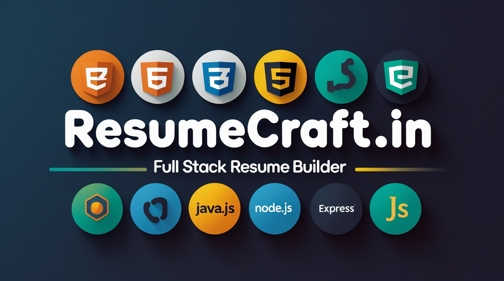

# 📄 ResumeCraft.in - Resume Builder Web Application

<div align="center">

### *Craft Your Perfect Resume with Ease*


---


** • [Documentation](#) • [Report Bug](#) • [Request Feature](#)**

---

*A full-stack web application for creating professional, ATS-friendly resumes with multiple templates, user profile management, and contact form integration.*

</div>

---

## 📋 Table of Contents
- [Project Overview](#project-overview)
- [Features](#features)
- [Tech Stack](#tech-stack)
- [File Structure](#file-structure)
- [Color Palette](#color-palette)
- [Setup Instructions](#setup-instructions)
- [Page Sections](#page-sections)
- [API Endpoints](#api-endpoints)
- [Dependencies](#dependencies)
- [Environment Variables](#environment-variables)
- [Browser Compatibility](#browser-compatibility)

---

## 🎯 Project Overview

ResumeCraft.in is a comprehensive web-based resume builder that helps job seekers create professional, ATS-optimized resumes. The application features multiple resume templates, user authentication via localStorage, a contact form with email integration, and an interactive FAQ section.

### Key Highlights:
- 🎨 **3 Professional Resume Templates** - Basic, Standard, and Modern designs
- 👤 **User Profile Management** - Local storage-based user sessions
- 📧 **Contact Form Integration** - Nodemailer-powered email system
- ❓ **Interactive FAQ Section** - With modal-based policy pages
- 📱 **Responsive Design** - Mobile-friendly interface
- 🎭 **Smooth Animations** - AOS and Animate.css integration

---

## ✨ Features

### Frontend Features
- ✅ **Landing Page** with animated hero section
- ✅ **User Profile System** with profile picture upload
- ✅ **Local Storage Authentication** - No backend authentication required
- ✅ **Resume Template Selection** - Three distinct templates
- ✅ **Interactive Navigation** - Sticky navbar with smooth scrolling
- ✅ **Social Media Integration** - Footer social links
- ✅ **Modal Popups** - For privacy policy and cookie policy
- ✅ **Custom Modals** - User action confirmations

### Backend Features
- ✅ **Express.js Server** - RESTful API structure
- ✅ **Nodemailer Integration** - Email sending functionality
- ✅ **CORS Enabled** - Cross-origin resource sharing
- ✅ **Body Parser** - JSON and URL-encoded data parsing
- ✅ **Static File Serving** - Public directory support

---

## 🛠️ Tech Stack

### Frontend Technologies
| Technology | Version | Purpose |
|------------|---------|---------|
| **HTML5** | Latest | Semantic markup structure |
| **CSS3** | Latest | Styling and animations |
| **JavaScript (ES6+)** | Latest | Client-side logic |
| **Animate.css** | 4.1.1 | CSS animations library |
| **AOS** | 2.3.1 | Scroll animations |
| **Font Awesome** | 6.0.0 | Icon library |
| **Google Fonts** | - | Roboto, Rubik, Dosis, Sofia |
| **Ionicons** | 7.1.0 | Modern icon set |

### Backend Technologies
| Technology | Version | Purpose |
|------------|---------|---------|
| **Node.js** | 14+ | JavaScript runtime |
| **Express.js** | 4.x | Web application framework |
| **Nodemailer** | 6.x | Email sending service |
| **Body-Parser** | 1.x | Request body parsing |
| **CORS** | 2.x | Cross-origin requests |

---

## 📁 File Structure

```
ResumeCraft.in/
│
├── contact-form-project/          # Contact form module
│   ├── index.js                   # Express server (Port: 3000)
│   ├── public/
│   │   ├── css/
│   │   │   └── style.css          # Contact form styles
│   │   └── images/
│   │       └── contactimg.png     # Contact page image
│   └── views/
│       └── contact.html           # Contact form page
│
├── faq/                           # FAQ section
│   ├── faq.html                   # FAQ page
│   ├── faq.css                    # FAQ styles
│   └── faq.js                     # FAQ interactivity
│
├── get-started/                   # Resume template selection
│   ├── index.html                 # Template selection page
│   ├── css/
│   │   └── production.css         # Template page styles
│   ├── img/                       # Template preview images
│   ├── 1/                         # Standard resume template
│   ├── 2/                         # Modern resume template
│   └── 3/                         # Basic resume template
│
├── image/                         # Global images
│   ├── logo-removebg-preview.png  # Main logo
│   ├── image.png                  # Favicon
│   ├── blank dp.jpg               # Default profile picture
│   └── [company logos]            # Client company logos
│
├── video/                         # Video assets
│   └── v1.mp4                     # Hero section video
│
├── ff.html                        # Main landing page
├── ff.css                         # Main landing page styles
│
├── package.json                   # Node.js dependencies
└── README.md                      # Project documentation
```

---

## 🎨 Color Palette

### Primary Colors
| Color Name | Hex Code | RGB | Usage |
|------------|----------|-----|-------|
| **Navy Blue** | `#0A2647` | `rgb(10, 38, 71)` | Headers, footers, primary elements |
| **Primary Green** | `#2DC08D` | `rgb(45, 192, 141)` | CTA buttons, accents |
| **Sky Blue** | `#5CAADA` | `rgb(92, 170, 218)` | Secondary elements |
| **Cream Background** | `#F0F8FF` | `rgb(240, 248, 255)` | Page backgrounds |

### Accent Colors
| Color Name | Hex Code | Usage |
|------------|----------|-------|
| **Accent Red** | `#E74C3C` | Delete/logout buttons |
| **Dark Gray** | `#333333` | Text color |
| **Light Gray** | `#F1F2F4` | Input backgrounds |
| **White** | `#FFFFFF` | Cards, containers |

### Gradient Combinations
```css
/* Header Gradient */
background: linear-gradient(45deg, #0A2647, #0d3664);

/* Button Hover */
background-color: #249e74; /* Darker green */
```

---

## 🚀 Setup Instructions

### Prerequisites
- Node.js (v14 or higher)
- npm (Node Package Manager)
- Gmail account (for Nodemailer)
- Modern web browser

### Installation Steps

1. **Clone the Repository**
   ```bash
   git clone <repository-url>
   cd ResumeCraft.in
   ```

2. **Install Dependencies**
   ```bash
   npm install
   ```

3. **Configure Email Service**
   
   Edit `contact-form-project/index.js`:
   ```javascript
   const transporter = nodemailer.createTransport({
     host: 'smtp.gmail.com',
     port: 587,
     auth: {
       user: 'your-email@gmail.com',        // Your email
       pass: 'your-app-specific-password'    // Gmail app password
     }
   });
   ```

   **Note**: Enable 2FA on Gmail and generate an [App Password](https://myaccount.google.com/apppasswords)

4. **Start the Server**
   ```bash
   cd contact-form-project
   node index.js
   ```
   Server runs on: `http://localhost:3000`

5. **Open the Application**
   - Open `ff.html` in your browser
   - Or use Live Server extension in VS Code

---

## 📄 Page Sections

### 1. **Landing Page** (`ff.html`)

#### Header Navigation
- Logo (centered)
- Navigation links: Home, About, Contact
- Profile icon with dropdown

#### Hero Section
- Headline: "Craft Your Perfect Resume"
- Tagline with statistics
- "Get Started" CTA button
- Animated video background

#### Customer Showcase
- Logos of companies where users got hired
- Boeing, Medtronic, Google, Amazon, TCS

#### How It Works
Three-step process with visual cards:
1. Select ATS-friendly template
2. Add targeted content
3. Download in PDF format

#### Ad Section
- 30-day free trial promotion
- Floating animated elements
- "Start Trial" button

#### About Section
- Company mission and vision
- Team information

#### Footer
- Quick links
- Resources (FAQ, Contact)
- Legal (Privacy, Cookies)
- Social media links
- Copyright information

---

### 2. **Profile Popup**

Features:
- Profile picture upload (local storage)
- Name input field
- Mobile number field
- Account list display
- Save profile button
- Remove all accounts option
- Logout functionality

**Storage**: Uses `localStorage` for persistence
- Key: `currentUser` - Active user data
- Key: `accounts` - Array of all user accounts

---

### 3. **Contact Form** (`contact.html`)

#### Features:
- Name input
- Email input
- Message textarea
- Animated labels (float on focus)
- Submit button with hover effects

#### Backend Processing:
```javascript
POST /submit-feedback
Body: {
  name: string,
  email: string,
  message: string
}
Response: Success/Error message
```

---

### 4. **FAQ Page** (`faq.html`)

#### Features:
- Expandable FAQ items
- Privacy Policy modal
- Cookie Policy modal
- Animated transitions
- Back to home button

#### Topics Covered:
- How to create a resume
- Pricing information
- ATS-friendly templates
- Customization options
- Update frequency

---

### 5. **Template Selection** (`get-started/index.html`)

#### Available Templates:

**1. Basic Resume**
- Clean and simple design
- Professional look
- Ideal for beginners

**2. Standard Resume**
- Classic layout
- Suitable for various industries
- Traditional format

**3. Modern Resume**
- Contemporary design
- Fresh, updated look
- Creative industries

Each card includes:
- Template preview image
- Description
- "Try This Template" button with animation

---

## 🔌 API Endpoints

### Contact Form API

**Base URL**: `http://localhost:3000`

#### Submit Feedback
```http
POST /submit-feedback
Content-Type: application/json

{
  "name": "John Doe",
  "email": "john@example.com",
  "message": "This is a test message"
}
```

**Response**:
```json
Success (200):
"Message sent successfully"

Error (500):
"An error occurred while sending the message"
```

---

## 📦 Dependencies

### Backend Dependencies
```json
{
  "express": "^4.18.2",
  "nodemailer": "^6.9.1",
  "body-parser": "^1.20.2",
  "cors": "^2.8.5"
}
```

### Frontend CDN Libraries
```html
<!-- CSS Libraries -->
<link href="https://cdnjs.cloudflare.com/ajax/libs/animate.css/4.1.1/animate.min.css" rel="stylesheet">
<link href="https://cdnjs.cloudflare.com/ajax/libs/font-awesome/6.0.0-beta3/css/all.min.css" rel="stylesheet">
<link href="https://unpkg.com/aos@2.3.1/dist/aos.css" rel="stylesheet">

<!-- JavaScript Libraries -->
<script src="https://unpkg.com/aos@2.3.1/dist/aos.js"></script>
<script src="https://cdnjs.cloudflare.com/ajax/libs/wow/1.1.2/wow.min.js"></script>
<script src="https://unpkg.com/ionicons@7.1.0/dist/ionicons/ionicons.esm.js" type="module"></script>
```

---

## 🔐 Environment Variables

Create a `.env` file in the root directory (optional):

```env
# Server Configuration
PORT=3000

# Email Configuration
EMAIL_HOST=smtp.gmail.com
EMAIL_PORT=587
EMAIL_USER=your-email@gmail.com
EMAIL_PASS=your-app-password
EMAIL_RECEIVER=ResumeCraft.in@gmail.com
```

Then update `index.js`:
```javascript
require('dotenv').config();

const transporter = nodemailer.createTransport({
  host: process.env.EMAIL_HOST,
  port: process.env.EMAIL_PORT,
  auth: {
    user: process.env.EMAIL_USER,
    pass: process.env.EMAIL_PASS
  }
});
```

---

## 🎯 Key Features Implementation

### 1. **LocalStorage User Management**
```javascript
// Save user
localStorage.setItem('currentUser', JSON.stringify({
  name: 'John Doe',
  mobile: '1234567890',
  profilePic: 'base64-image-string'
}));

// Retrieve user
const currentUser = JSON.parse(localStorage.getItem('currentUser'));
```

### 2. **Profile Picture Upload**
```javascript
// File input change event
profilePictureUpload.addEventListener('change', function(event) {
  const file = event.target.files[0];
  const reader = new FileReader();
  reader.onload = function(e) {
    profilePicture.src = e.target.result;
    // Save to localStorage
  }
  reader.readAsDataURL(file);
});
```

### 3. **Email Sending**
```javascript
// Server-side (Express)
app.post('/submit-feedback', (req, res) => {
  const { name, email, message } = req.body;
  
  const mailOptions = {
    from: email,
    to: 'ResumeCraft.in@gmail.com',
    subject: 'New Feedback Submission',
    text: `Name: ${name}\nEmail: ${email}\nMessage: ${message}`
  };
  
  transporter.sendMail(mailOptions, (error, info) => {
    if (error) {
      res.status(500).send('Error sending message');
    } else {
      res.status(200).send('Message sent successfully');
    }
  });
});
```

### 4. **Smooth Scroll Navigation**
```css
html {
  scroll-behavior: smooth;
}
```

```html
<a href="#about">About</a>
<section id="about">...</section>
```

---

## 🌐 Browser Compatibility

| Browser | Version | Support |
|---------|---------|---------|
| Chrome | 90+ | ✅ Full Support |
| Firefox | 88+ | ✅ Full Support |
| Safari | 14+ | ✅ Full Support |
| Edge | 90+ | ✅ Full Support |
| Opera | 76+ | ✅ Full Support |

---

## 📱 Responsive Design

### Breakpoints
```css
/* Tablet */
@media (max-width: 1000px) { ... }

/* Mobile */
@media (max-width: 768px) { ... }

/* Small Mobile */
@media (max-width: 900px) { ... }
```

---

## 🔧 Troubleshooting

### Common Issues

**1. Email Not Sending**
- Check Gmail app password
- Enable "Less secure app access" (if not using 2FA)
- Verify SMTP settings

**2. LocalStorage Not Working**
- Check browser privacy settings
- Clear browser cache
- Ensure cookies are enabled

**3. Profile Picture Not Uploading**
- Check file size (< 5MB recommended)
- Verify file format (JPG, PNG)
- Check browser console for errors

**4. Server Not Starting**
- Verify port 3000 is available
- Check Node.js installation
- Run `npm install` again

---

## 🚀 Future Enhancements

- [ ] Backend user authentication (JWT)
- [ ] Database integration (MongoDB)
- [ ] Resume export to PDF
- [ ] Real-time resume preview
- [ ] AI-powered content suggestions
- [ ] Payment gateway integration
- [ ] Email verification system
- [ ] Password reset functionality
- [ ] Resume version history
- [ ] Collaborative editing
- [ ] Mobile app development

---

## 📝 Scripts

```json
{
  "scripts": {
    "start": "node contact-form-project/index.js",
    "dev": "nodemon contact-form-project/index.js",
    "test": "echo \"No tests specified\""
  }
}
```

---

## 👥 Contributing

1. Fork the repository
2. Create feature branch (`git checkout -b feature/AmazingFeature`)
3. Commit changes (`git commit -m 'Add AmazingFeature'`)
4. Push to branch (`git push origin feature/AmazingFeature`)
5. Open a Pull Request

---

## 👤 Author

**ResumeCraft Team**

- Website: [ResumeCraft.in](#)
- Email: ResumeCraft.in@gmail.com
- Facebook: [@ResumeCraft](https://www.facebook.com/profile.php?id=61564648493544)
- Twitter: [@ResumeCraft_in](https://x.com/ResumeCraft_in)
- LinkedIn: [ResumeCraft](https://www.linkedin.com/in/resumee-craft-a00668323/)
- Instagram: [@resumecraft_in](https://www.instagram.com/resumecraft_in/)

---

## 🙏 Acknowledgments

- Font Awesome for icon library
- Ionicons for modern icons
- Google Fonts for typography
- Animate.css for animations
- AOS for scroll animations
- Nodemailer for email integration
- Express.js community

---

## 📞 Support

For support, email ResumeCraft.in@gmail.com or visit the contact page.

---

<div align="center">

**⭐ Star this repo if you find it helpful! ⭐**

**Made with ❤️ by ResumeCraft Team**

© 2024 ResumeCraft.in. All rights reserved.

</div>
